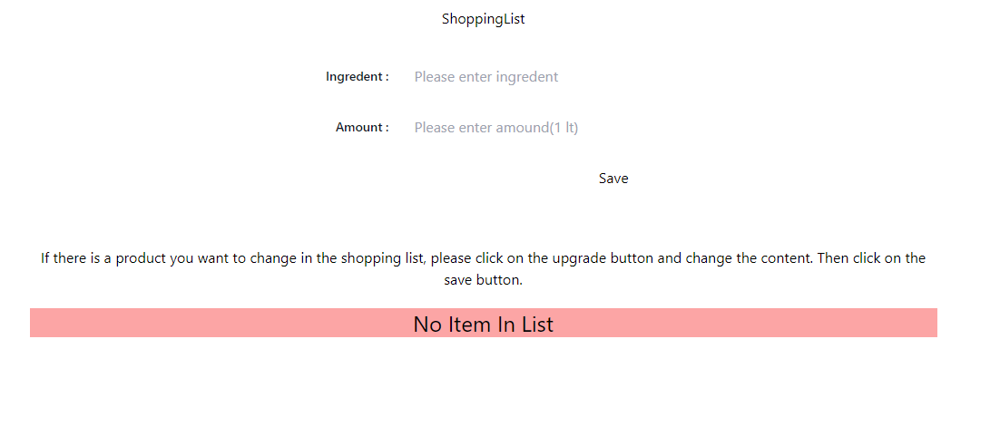
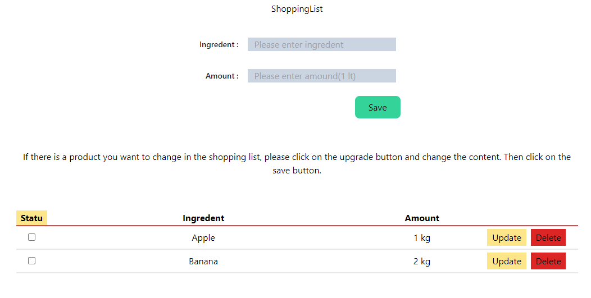
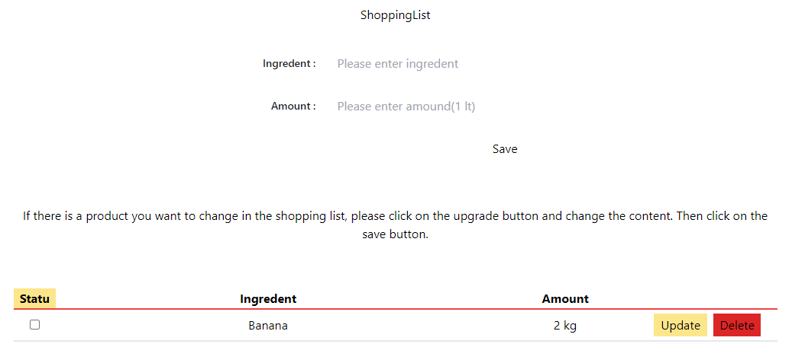
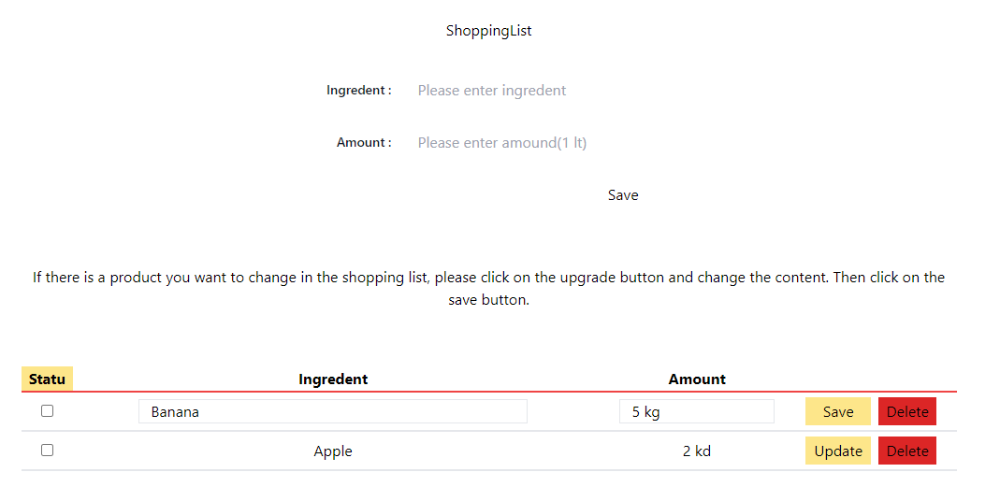
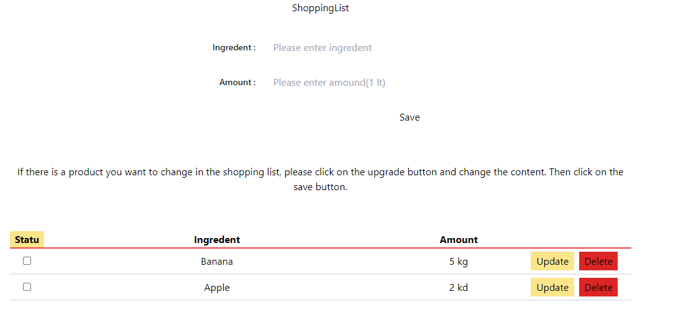

Follow these steps to run it : 1 - npm install == To download the necessary documents 2 - npm start == To start project and then use the link that is in console.

and if you want to delete item from list, only click delete

If there is a product you want to change in the shopping list, please click on the upgrade button and change the content.

Then click on the save button.

# React + Vite

This template provides a minimal setup to get React working in Vite with HMR and some ESLint rules.

Currently, two official plugins are available:

- [@vitejs/plugin-react](https://github.com/vitejs/vite-plugin-react/blob/main/packages/plugin-react/README.md) uses [Babel](https://babeljs.io/) for Fast Refresh
- [@vitejs/plugin-react-swc](https://github.com/vitejs/vite-plugin-react-swc) uses [SWC](https://swc.rs/) for Fast Refresh
